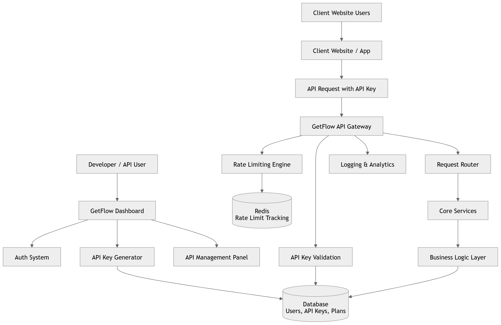

# 🚀 GetFlow  
### Managed API Control & Monetization Platform  


> Protect • Monitor • Monetize APIs

GetFlow is a full-stack API management and subscription platform that enables developers and businesses to securely manage, monitor, and monetize APIs using authentication, API keys, rate limiting, analytics, and integrated payment handling.

---

# 🌟 Overview

Modern applications rely heavily on APIs. Managing authentication, traffic control, analytics, and monetization can become complex.

GetFlow provides:

- 🔐 Secure JWT-based authentication  
- 🔑 API key generation & validation  
- 🚦 Redis-powered rate limiting  
- 💳 Subscription & payment integration (SSLCommerz)  
- 📊 API usage analytics dashboard  
- ⏳ Automated subscription expiry system  

---
## 🏗️ System Architecture



Background Services:
- ⏳ Cron Job → Plan Expiry Handler  
- 📧 Nodemailer → Email Notifications  
- 💳 SSLCommerz → Payment Processing  

---

# ✨ Core Features

## 🔐 Authentication & Authorization
- JWT-based authentication
- Password hashing with bcrypt
- Secure cookies
- Protected route middleware

## 🔑 API Key Management
- Generate & revoke API keys
- Per-user API isolation
- Secure validation middleware

## 🚦 Rate Limiting
- Redis-backed distributed rate limiting
- Per-user / per-key / per-endpoint limits
- Prevents API abuse
- Returns HTTP 429 when exceeded

## 💳 Subscription & Monetization
- SSLCommerz payment integration
- Plan-based API access
- Automatic expiry via cron job
- Monetization-ready architecture

## 📊 Analytics & Monitoring
- API usage tracking
- Traffic statistics
- Charts using Recharts & Chart.js

## 📧 Email Notifications
- Nodemailer integration
- Plan updates & alerts

---

# 🛠️ Tech Stack

## Backend
- Node.js
- Express 5
- PostgreSQL (Sequelize ORM)
- Redis (ioredis)
- JWT
- rate-limiter-flexible
- node-cron
- SSLCommerz SDK

## Frontend
- React 19
- React Router v7
- Axios
- Recharts & Chart.js
- React Toastify
- Socket.io Client

---

# 📂 Project Structure

```
getflow/
│
├── backend/
│   ├── src/
│   │   ├── routes/
│   │   ├── controllers/
│   │   ├── middleware/
│   │   ├── models/
│   │   ├── services/
│   │   ├── db/
│   │   ├── jobs/
│   │   ├── utils/
│   │   ├── script/
│   │   └── app.js
│   ├── server.js
│   └── package.json
│
├── frontend/
│   ├── src/
│   │   ├── components/
│   │   ├── controllers/
│   │   ├── services/
│   │   ├── pages/
│   │   ├── App.js / App.tsx
│   │   └── index.js
│   └── package.json
│
└── README.md
```

---

# ⚙️ Installation Guide

## 1️⃣ Clone Repository

```bash
git clone https://github.com/your-username/getflow.git
cd getflow
```

---

# 🔹 Backend Setup

```bash
cd backend
npm install
```

Create a `.env` file inside the `backend` folder:

```
PORT=8000

# PostgreSQL Configuration
DB_USER=your_db_user
DB_HOST=localhost
DB_NAME=getflow
DB_PASSWORD=your_db_password
DB_PORT=5432

# Redis Configuration
REDIS_HOST=127.0.0.1
REDIS_PORT=6379

# Authentication
JWT_SECRET=your_super_secret_key

# SSLCommerz Payment
SSL_STORE_ID=your_ssl_store_id
SSL_STORE_PASSWORD=your_ssl_store_password

# Frontend URL (CORS)
FRONTEND_URL=http://localhost:3000
```

Start backend (development):

```bash
npm run dev
```

Start backend (production):

```bash
npm start
```

---

# 🔹 Frontend Setup

```bash
cd frontend
npm install
npm start
```

Frontend runs on:

```
http://localhost:3000
```

Backend runs on:

```
http://localhost:8000
```

---

# 🐘 Database Setup

Make sure PostgreSQL is installed and running.

Create database manually:

```sql
CREATE DATABASE getflow;
```

Ensure `.env` credentials match your local PostgreSQL configuration.

---

# 🔴 Redis Setup

Make sure Redis server is running.

Linux / Mac:
```bash
sudo service redis-server start
```

Windows:
```bash
redis-server
```

---

# 🔄 How GetFlow Works

1. User registers & logs in  
2. User subscribes to a plan  
3. API key is generated  
4. Each API request:
   - JWT validation  
   - API key verification  
   - Redis rate limit check  
   - Request routed to service  
5. Usage stored in PostgreSQL  
6. Cron job automatically disables expired subscriptions  

---

# 🔒 Security Features

- Password hashing (bcrypt)
- JWT verification
- Redis-based rate limiting
- Secure cookies
- CORS protection
- Environment variable isolation

---

# 📈 Future Improvements

- Usage-based billing
- Multi-tenant support
- Stripe integration
- Webhook system
- OpenAPI documentation
- Docker & Kubernetes deployment
- Auth Provide System

---

# 👨‍💻 Author

Md.Ibrahim Khalilulla 
An aspiring software engineer
B.Sc in Information and Communication Engineering,University of Rajshahi 
Rajshahi, Bangladesh 

## 🤝 Acknowledgements

- Thanks to [SifatUlla Mondol] for contributing to the frontend development and helping improve the UI/UX of this project.

Project: GetFlow – API Management & Monetization Platform  

---

# 📜 License

ISC License